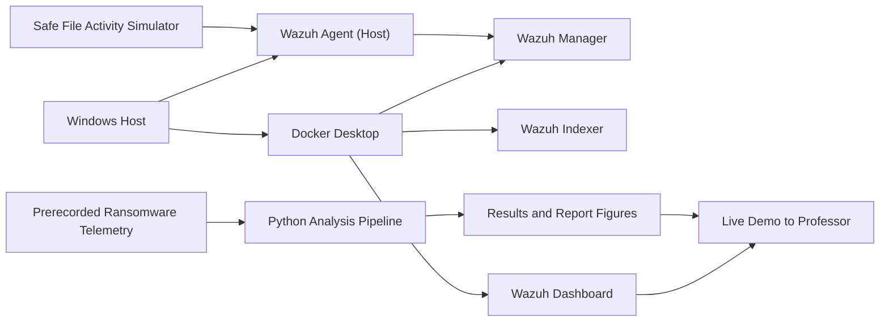

# Demo Architecture

## Key Points

- The Wazuh stack is live in Docker Desktop.
- The ransomware evidence is replayed telemetry, not active malware.
- The live simulation is harmless and exists only to prove the detection path works in real time.
- The report combines dashboard evidence with computed metrics and standards mapping.
