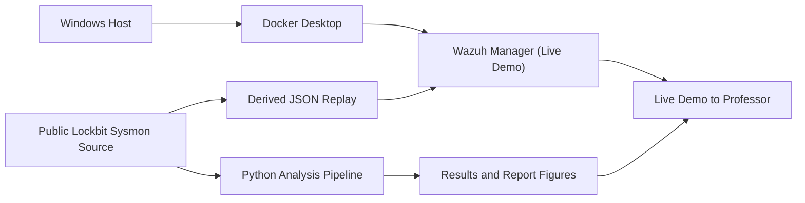

# Demo Architecture

## Key Points

- The Wazuh manager is live in Docker Desktop.
- The ransomware evidence is derived from a public Lockbit telemetry source, not from active malware.
- The live replay exists to prove the detection path works in real time without malware execution.
- The report combines dashboard evidence with computed metrics and standards mapping.
